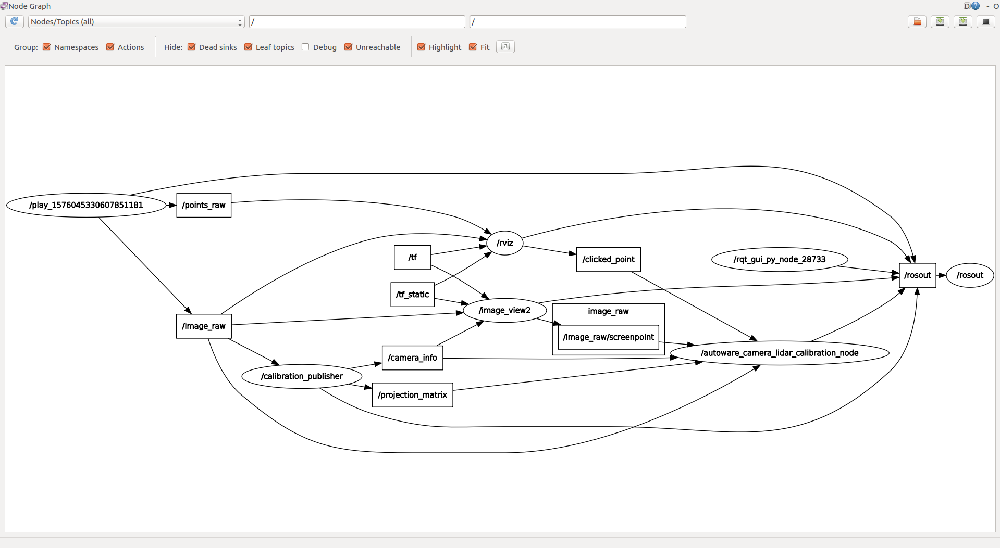
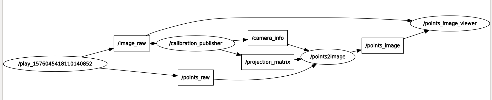
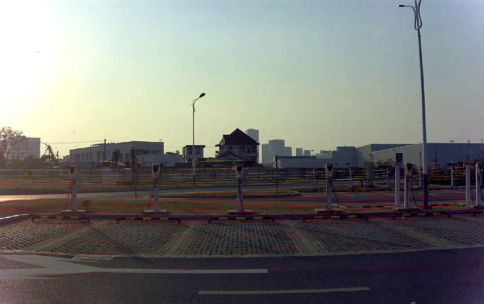

# Usage

## Camera-LiDAR Extrinsic Calibration

### Calibration

Follow the [instructions](autoware_camera_lidar_calibrator/README.md) of the calibration tool from Autoware to get the extrinsic parameters.

The graph shown by `rqt_graph` should be similar to the following:



### Evalutation

1. Update the camera parameter file in [autoware_camera_lidar_calibrator/data](autoware_camera_lidar_calibrator/data).
2. Launch the script:
   
   ```
   roslaunch autoware_camera_lidar_calibrator evaluate_camera_lidar_calibration.launch  calib_file:=/path/to/autoware_lidar_camera_calibration.yaml
   ```
3. Play the bag:
   
   ```
   rosbag play data.bag
   ```

The graph shown by `rqt_graph` should be similar to the following:



The images shown in the viewer should be like:

